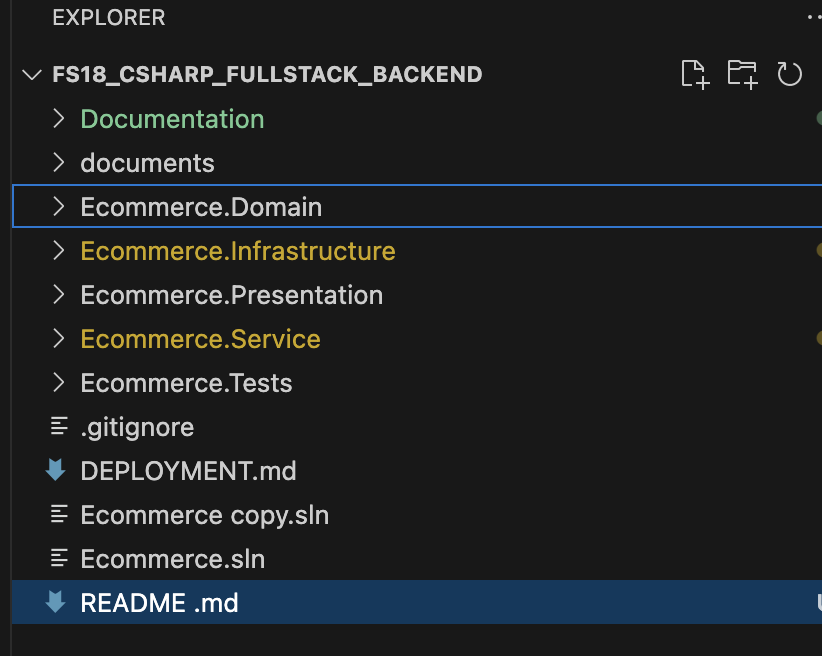
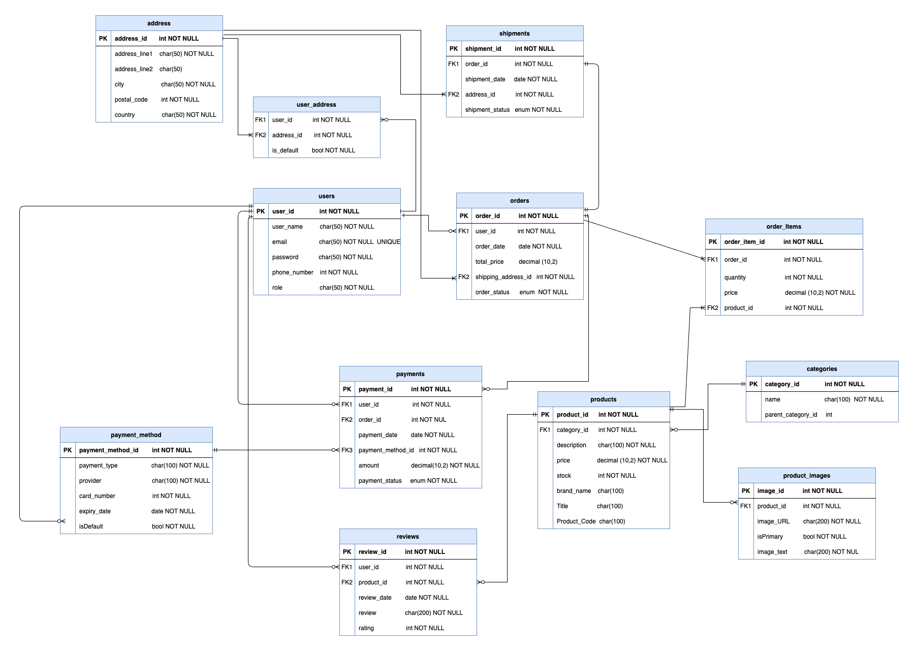

# Nordic Porcelain: E-commerce System


## Table of Contents

1. [Introduction](#introduction)
   - [Frontend](#frontend)
   - [Backend](#backend)
   - [Installation and Usage](#installation-and-usage)
2. [Features](#features)
   - [User Functionalities](#user-functionalities)
   - [Admin Functionalities](#admin-functionalities)
3. [Architecture and Design](#architecture-and-design)
   - [CLEAN Architecture](#clean-architecture)
   - [Folder Structure](#folder-structure)
4. [Testing](#testing)

## Introduction

Nordic Porcelain is a full-stack e-commerce system that allows users to browse, purchase, and manage products while providing administrators with full control over the system's products, users, and orders.

### Frontend

- **Technologies**: Material UI, TypeScript, React, Redux Toolkit
- **Hosted On**: Netlify

### Backend

- **Technologies**: ASP.NET Core 8, Entity Framework Core, PostgreSQL
- **Hosted On**: Azure , Neon.tech
- **Admin Credentials**: email : asangi@gmail.com, password : Abc123

---

## Features

### User Functionalities

1. **User Registration & Profile Management**:
   - Users can register, log in, and update their profile information.
2. **Product Browsing**:
   - Users can browse, search, and sort products by various filters (e.g., category, price range, etc.).
3. **Shopping Cart**:
   - Users can add products to their cart, adjust quantities, and remove items.
4. **Order Placement**:
   - Users can place orders, and view the history of their past orders with order status updates.

### Admin Functionalities

1. **User Management**:
   - Admins can manage user accounts, including editing or deleting user profiles.
2. **Product Management**:
   - Admins can add, update, and remove products from the store.
3. **Order Management**:
   - Admins can view, update, and manage customer orders, including shipping status.

### Extra Features

- **Advanced Search**:
  - Search products based on multiple parameters such as category, price, and popularity.
- **Discount Management**:
  - Admins can create and manage discount codes for users.
- **Reviews**:
  - Product reviews can be added by user for products.

---

## Architecture and Design

The system follows **CLEAN Architecture** principles to ensure the separation of concerns, maintainability, and scalability of the project. The system is designed to separate business logic, data access, and user interface, ensuring that each layer is independent and testable.

### CLEAN Architecture

- **Core**: Contains business logic and domain models, shared across both frontend and backend.
- **Application**: Contains services, repositories, and use cases for business rules.
- **Infrastructure**: Deals with external systems like the database (PostgreSQL), hosting, and third-party services.
- **Presentation**: The frontend and API layers handle user interaction and data presentation.

### Folder Structure

```
/src
    ├── /Components        # Reusable React components
    ├── /Pages             # Page-level components (ProductPage, AdminPage, etc.)
    ├── /Slices            # Redux slices for state management
    ├── /Store             # Redux store configuration
    ├── /Types             # TypeScript type definitions
    ├── /Backend           # ASP.NET Core backend code
    ├── /Database          # PostgreSQL scripts, migrations
    ├── /Styles            # CSS and styling files
    └── /Tests             # Unit and integration tests
```



## Database Design

The Entity-Relationship (ER) diagram below is the primary design element for this project. All the API endpoints were designed according to the ER diagram.

## 

## Installation and Usage

### Prerequisites

- **Node.js** (v14 or higher)
- **.NET SDK** (v8.0 or higher)
- **PostgreSQL** (for the database)
- **Azure/Netlify** (optional for deployment)

### Steps

1. **Clone the Repository**:

   ```bash
   git clone https://github.com/asangika/fs18_CSharp_FullStack_Backend.git
   cd Ecommerce.Infrastucture
   ```

2. **Install Frontend Dependencies**:

   ```bash
   npm install
   ```

3. **Setup Backend**:

   - Update the connection string in `appsettings.json` to your PostgreSQL instance.
   - Run migrations:
     ```bash
     dotnet ef database update
     ```

4. **Run the Backend**:

   ```bash
   dotnet run
   ```

5. **Run the Frontend**:
   ```bash
   npm run dev
   ```

---

## Testing

To ensure code quality, both frontend and backend are thoroughly tested using unit tests, with optional integration tests.

### Frontend Testing:

- **React Testing Library**: Unit tests for React components.
- **Jest**: Test runner for JavaScript/TypeScript tests.

### Backend Testing:

- **xUnit**: Unit testing framework for .NET Core.
- **Mocking with Moq**: Mock dependencies to test controllers and services.

Run tests with:

- **Frontend**:

  ```bash
  npm test
  ```

- **Backend**:
  ```bash
  dotnet test
  ```

### Coverage

Aim for high test coverage across critical functionalities, such as:

- User registration and authentication.
- Product search, filtering, and sorting.
- Cart and checkout functionalities.
- Admin management of users, products, and orders.

---

---
